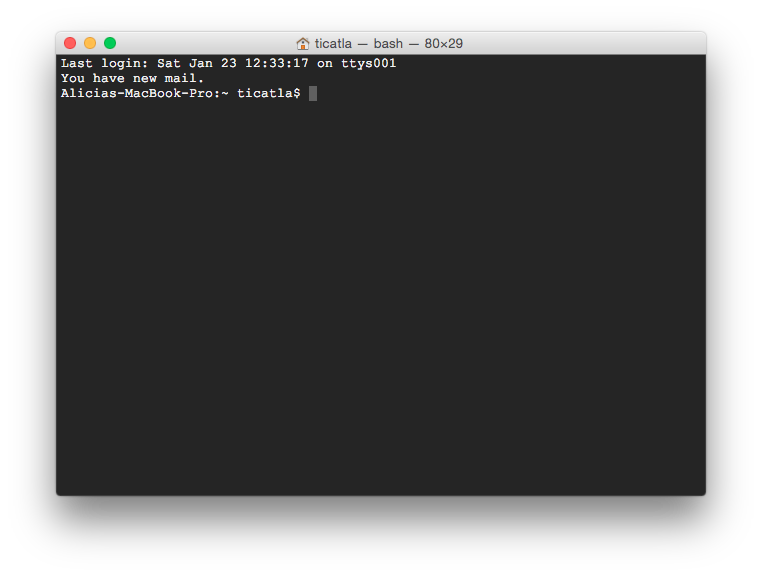
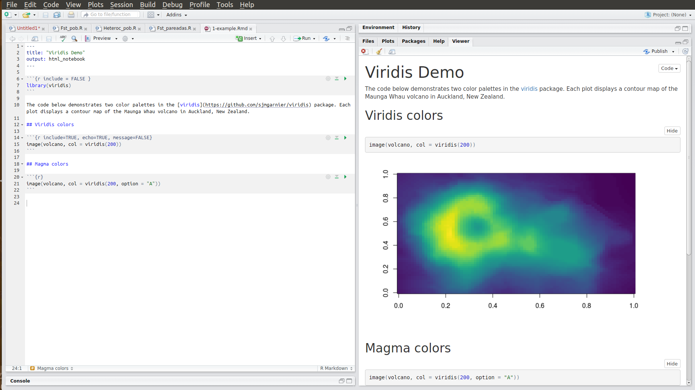
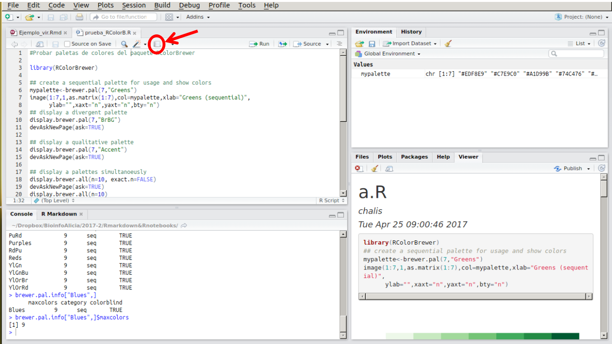

# Unidad 1: Introducción a la programación


## Código en computación

* Instrucciones escritas **para una computadora** en un **lenguaje de cómputo**   
* Paso por paso hasta una solución.
* El código puede ser muy largo y formar un programa (**software**) entero o de una sóla línea para realizar una única operación.
* Escribir código para que lo ejecuten las computadoras y **comentado** para seres humanos.

**Ejercicio del pan**


## Un poco de historia


#### Tarea 1a:

Escoger uno de los artículos: 

* Gauthier et al (2018) Briefings in Bioinformatics: 
* Stephens et al (2015) PLoS Biology: 
* Fessenden (2014) Smithsonian Magazine: What Happened to All the Women in Computer Science?
* Timeline (2017): Women pioneered computer programming. Then men took their industry over.

Y escribir un ensayo (detalles en Google Classroom)


#### Tarea 1b:

Buscar en los autor guidelines de una revista científica donde se publiquen artículos de evolución molecular adaptativa cuáles son sus políticas de disponibilidad de datos y código asociados a artículos publicados ahí. (detalles en Google Classroom).


## Cómo buscar ayuda (permanentemente)

Una *habilidad* indispensable en bioinformática

El objetivo de esta clase no es darte un manual completo para resolver cualquier cuestión bioinformática, sino darte las habilidades y herramientas para que llegues por tí misma a las soluciones. Para esto hay una habilidad indispensable: **buscar ayuda en internet**. La enorme mayoría de las preguntas que te hagas sobre bioinformática y programación en general, sobre todo al principio, **son las mismas dudas que tuvieron otros antes** y, casi seguro **las respuestas ya están en algún lugar del internet**. Y si nadie a escrito con tu duda, puedes preguntar. 

Las respuestas a muchas de las tareas que dejaré aparecen en los primeros resultados si haces la búsqueda correcta en internet. De hecho, a veces parte de la tarea será que *se te ocurra cómo buscar* la solución en internet. Esto está perfectamente bien y es muuuy distinto a copiarle a un compañero. Saber buscar ayuda e información en interent es una habilidad básica del siglo XXI. 

Por esto estoy 100% de acuerdo con xkcd, no tienes que saberlo todo de memoria. Se vale tener una *Mente extendida* llamada internet:


* Google o Duckgogo o el motor de búsqueda que uses.

* [Stacksoverflow](https://stackoverflow.com/): es un foro de ayuda para programación en general, viene dividido por lenguajes. La gente hace preguntas y contesta. Es como un yahoo answers super pro, lxs programadorxs con muchas preguntas respondidas ganan puntos que son algo muy visible para un CV con ese perfil. Este foro es mejor para dudas de bash, R, python y no de programas genéticos.

* [Biostars](https://www.biostars.org/) es parecido a Stacksoverflow un foro de ayuda especializado en Bioinformática. Aquí sí puedes hacer preguntas enfocadas en datos y software genético, por ejemplo cómo mover de un formato de genomas a otro.

* Grupos de usuarios de un software. Por ejemplo [este de Stacks](https://groups.google.com/forum/#!forum/stacks-users). Son ideales para aclarar detalles específicos y mensajes de error de **ese** software (ie, no de dudas de cómo usar la línea de comando). La comunidad es súper chida y muchas veces lxs autores del software son quiénes responden. 


**Tips sobre cómo pedir/buscar ayuda**

* Busca en inglés

* Piensa bien cuáles son las **palabras clave de tu pregunta** y cómo **generalizar** tu caso a algo que cualquiera entienda y que no sea específico a tu computadora. Por ejemplo "How to list files in a directory using the Terminal?" es mucho mejor mejor que "which files are in Manzanas" (tu y yo sabemos que Manzanas es un directorio, pero no el mundo).

* Si vas a pedir ayuda en un foro, lee las reglas y tipo de preguntas atentidas por el foro antes de preguntar. 

* Sigue estas recomendaciones de Stacksoverflow sobre [cómo redactar una buena pregunta](https://stackoverflow.com/help/how-to-ask)

* Si recibes un mensaje de error en la Terminal, R, etc. Copia-pégalo a tu motor de búsqueda favorito.


## Introducción a la consola y línea de comando de bash y R

Vamos a abrir la terminal. Debe ser un ícono parecido a este. En Ubuntu debe estar por default en tu dock. Si no lo encuentras tanto en Mac como en Ubuntu prueba buscar "Terminal" o "Console".


Tu terminal abierta debe verse parecida a esta:



La primera línea dice la fecha y hora y "ttys001". ttys viene de "Teletype" ([un poco de historia aquí](http://stackoverflow.com/questions/4532413/what-is-tty-on-freebsd)) y significa que el *input* es nuestro teclado, identificado como ttys001. 

En mi caso la segunda línea me dice que tengo correo. Uds probablemente no tengan esto.

La tercera línea es la más importante: dice el **nombre del equipo** (Alicas-MacBook-Pro en este caso), el **directorio** donde estoy (`~` significa "home directory", lo veremos más adelante) y el **nombre del usuario** con quién estoy en la terminal (en mi caso ticatla). 

Notarás que la tercera línea termina en `$`

`$` significa que la terminal está corriendo con un interpretador Shell o Bash y por un usuario sin mayores privilegios. Si termina en `#` significa que la estás corriendo como **root** que es un "súper usuario" con permisos para desconfigurarlo todo, ten cuidado. 


#### ¿Qué significa que La Terminal tenga un interpretador? 

Que le damos comandos y nos responde. 

El la Terminal no existe el *point and click*. El que funcione como una Línea de Comando significa que tienes que darle comandos de qué hacer línea por línea. 

Por ejemplo:

`date` nos responde la fecha actual

`echo algo` nos responde el texto "algo". También lo puedes utilizar con más de una palabra. 

`echo hello world`

Algo así debe verse tu terminal:


Pero por practicidad y para facilitar el copiar-pegar en vez de la imágen de la Terminal pondré los comandos (código) y sus resultados, así:

```
Alicias-MacBook-Pro:~ ticatla$ date
Sat 23 Jan 2016 14:46:06 CST
Alicias-MacBook-Pro:~ ticatla$ echo algo
algo
Alicias-MacBook-Pro:~ ticatla$ echo hello world
hello world
```

Que es lo mismo que:

```
$ date
Sat 23 Jan 2016 14:46:06 CST
$ echo algo
algo
$ echo hello world
hello world
``` 
 
Para facilidad visual, de aquí en adelante utilizaremos la opción con el texto a partir de `$` (al menos que sea pertinente ver lo que hay antes). Este tipo de formato te lo encontrarás en diversos foros de ayuda, libros de textos y manuales.

**Ojo** Se pone `$` solo para **distinguir** que lo que sigue es un comando que debes poner en la Terminal, por lo que **NO** debes copiar los comandos a tu terminal incluyendo el `$`.
 

**Pregunta**: ¿Qué pasa si intentas correr el comando  `algo`?:

La terminal dirá:

    -bash: algo: command not found

Que quiere decir que no existe el comando `algo`. 

De igual forma si corres `$ date` (incluyendo el `$`) te dirá que no existe el comando `$`, aunque `date` sí sea un comando.


La práctica hace al maestro. A continuación veremos algunos de los comandos básicos, pero para practicar más parte de la tarea será resolver los siguientes cursos prácticos:

* Terminar el curso [Learn the Command Line de CodeAcademy](https://www.codecademy.com/learn/learn-the-command-line).

* Adentrarse en el bosque con este [juego de bash](http://web.mit.edu/mprat/Public/web/Terminus/Web/main.html).

# Introducción a R con un enfoque bioinformático


### ¿Qué es R?
* R es un lenguaje de programación y un ambiente de cómputo estadístico
* R es software libre (no dice qué puedes o no hacer con el software), de código abierto (todo el código de R se puede inspeccionar - y se inspecciona).
* Cuando instalamos R, instala la base de R. Mucha de la funcionalidad adicional está en **paquetes** que la comunidad crea.

#### ¿Por qué R?
* R funciona en casi todas las plataformas (Mac, Windows, Linux).
* R es un lenguaje de programación completo, permite desarrollo de DSLs (funciones muy específicas)
* R promueve la investigación reproducible: no sólo de análisis sino de cómo se hicieron las figuras.
* R está actualizado gracias a que tiene una activa comunidad. Solo en CRAN hay cerca de 8000 paquetes (funcionalidad adicional de R creadas creada por la
comunidad).
* R se puede combinar con herramientas bioinformáticas y formatos de datos procesados (e.g. plink, vcf, etc) para realizar análisis y figuras.
* R tiene capacidades gráficas muy sofisticadas.
* R es popular como herramienta estadística (la guerra del software) y cada vez más también como herramienta bioinformática.
* Además del repositorio de paquetes de todo tipo de R (CRAN) también hay un repositorio especializado en paquetes de bioinformática (Bioconductor)


#### Descargar R y RStudio
Para comenzar se debe descargar [R](https://cran.r-project.org), esta descarga incluye R básico y un editor de textos para escribir código. Después de descargar R se recomienda descargar [RStudio](https://www.rstudio.com/products/rstudio/download/) (gratis y libre).

**RStudio** es un ambiente de desarrollo integrado para R: incluye una consola, un editor de texto y un conjunto de herramientas para administrar el espacio de trabajo cuando se  utiliza R.

#### ¿Cómo entender R?
* Hay una sesión de R corriendo. La consola de R es la interfaz entre R y nosotros.
* En la sesión hay objetos. Todo en R es un objeto: vectores, tablas,  funciones, etc.
* Operamos aplicando funciones a los objetos y creando nuevos objetos.

##### La consola (o terminal)

`R` es un programa que funciona con la línea de comando y por lo tanto puede correrse desde la terminal de varias formas o en su propia terminal.

```{bash}
$ R
R version 3.2.2 (2015-08-14) -- "Fire Safety"
Copyright (C) 2015 The R Foundation for Statistical Computing
Platform: x86_64-apple-darwin13.4.0 (64-bit)

R is free software and comes with ABSOLUTELY NO WARRANTY.
You are welcome to redistribute it under certain conditions.
Type 'license()' or 'licence()' for distribution details.

  Natural language support but running in an English locale

R is a collaborative project with many contributors.
Type 'contributors()' for more information and
'citation()' on how to cite R or R packages in publications.

Type 'demo()' for some demos, 'help()' for on-line help, or
'help.start()' for an HTML browser interface to help.
Type 'q()' to quit R.

> 1+1
[1] 2
> quit()
```

Con `quit()` salgo de la Terminal de R y vuelvo a la Terminal de bash.

R también tiene su propia terminal (lo que sale cuando abres R via su ícono). Sin embargo, nosotros ocuparemos RStudio, que es una interfaz visual que integra la terminal de R con varias funcionalidades útiles e intuitivas.


##### Scripts dentro de R

Un **script** es un **archivo** de nuestros análisis que es:

* un archivo de texto plano
* permanente,
* repetible,
* anotado y
* compartible


En otras palabras, un script es una recopilación por escrito de las instrucciones que queremos enviar a la consola, de modo que al tener esas instrucciones cualquiera pueda repetir el análisis tal cual se hizo.

RStudio brinda además de la consola un editor de texto, donde puedes **escribir un script**. Lo que escribas en el editor de texto puede "enviarse" a la consola con los shortcuts de abajo o con el ícono correr.

Un script muy sencillo podría verse así:


"Ejemplo_script.R" es el nombre del archivo, es decir, que este texto es un **archivo de texto** (con terminación .R en vez de .txt) que vive en mi computadora.


Si haces los análisis de tu trabajo en la terminal sin tenerlos en un script es como enviar la introducción de tu tesis por mensajes de chat sin haberla escrito nunca de corrido en un solo archivo. Considera el correr comandos en la terminal como una **prueba** y ya que todo funcione, pon todos los comandos juntos en **uno omás scripts documentados** y deja que corra el análisis de principio a fin solito (veremos adelante cómo).

La idea es que en el editor de texto vayas escribiendo los comandos y comentarios de tu **script** hasta que haga exactamente lo que quieras.

**NOTA IMPORTANTE**: el workingdirectory de un script siempre es el directorio donde está guardado dicho script. Entonces, es importante que si tu script va a manejar directorios (`cd` a algún lugar) lo planees todo con **rutas relativas** empezando en el directorio donde guardarás el script. ¿Dónde es un buen lugar para guardar el script? Lo veremos con detalle en otra unidad, pero en resumen el mejor lugar es en el mismo directorio que los datos, o en uno muy cercano.


#### Algunos _shortcuts_ útiles en RStudio:

**En el editor**  

* command/ctrl + enter: enviar código a la consola  
* ctrl + 2: mover el cursor a la consola

**En la consola**  

* flecha hacia arriba: recuperar comandos pasados  
* ctrl + flecha hacia arriba: búsqueda en los comandos  
* ctrl + 1: mover el cursor al editor  
* ? + nombre de función: ayuda sobre esa función.


## Rmarkdown y R Notebook

[R Markdown](http://rmarkdown.rstudio.com/index.html) es un formato que te permite crear documentos o reportes, en los que al mismo tiempo guardas y ejecutas código.



Primero, instala R Markdown:

```
 install.packages("rmarkdown")
```

Ahora puedes crear un archivo `.Rmd` en "Archivo > Nuevo archivo > R Markdown". (nota que estoy es distinto que R script).

Un archivo R Markdown es un archivo de texto plano que debe verse algo así:


El archivo tiene tres tipos de contenido:

- Encabezado (---)
- Código (```)
- Texto simple (Markdown)


Notarás que se pueden ejecutar las líneas de código de forma independiente e interactiva, y que el output (lo que saldría en la consola o los plots) del código de muestra debajo de éste.


Cuando abres o creas un archivo Rmd la interfaz de RStudio cambia. Ahora, puedes ejecutar el código usando las flechas y los resultados se despliegan a continuación del código.


**Archivos de salida**

A partir de un archivo .Rmd, es posible crear archivos de salida en una gran variedad de formatos, por ejemplo:

- HTML
- Documentos interactivos
- Word
- Diapositivas
- PDF
- Páginas web
- R Notebooks

Checa más formatos de salida [aquí](http://rmarkdown.rstudio.com/formats.html)

Para crear el reporte o archivo de salida, debes correr `render()`, dar click en "Knit" o ⇧+Ctrl+K.

Cuando se renderea un archivo .Rmd, también se crea un archivo html. Este es un archivo HTML que contiene el código y los output resultantes, que puede abrirse en cualquier explorador web y en RStudio.


### Generar un reporte de un script .R

Es posible generar un reporte a partir de un script de R, aún cuando **no tenga el formato de un archivo R Markdown**. Únicamente das click en el cuaderno (Compile report) o Ctrl+Shift+K.




### ¿Rmd o reporte de script.R?

Un Rmarkdown es más útil si quieres hacer un reporte de los análisis, o incluso escribir tu tesis, utilizando R, de forma que tanto el texto explicativo como el código estén integrados en el mismo archivo. Esto garantiza la reproducibilidad total, pero solo funciona si todo lo vas a hacer con R y si te acomoda que otros comenten tu documento así.

Un reporte de un script.R funciona si quieres "guardar cómo se ve" correr un análisis o discutirlo con tus colegas, pero no son un reporte tan bonito para entregar a alguien externo. 

Así que cuándo usar cuál depende de la situación y tus gustos.


## Funciones básicas de R 


### R Básico

Antes de pasar a las funciones bionformáticas, veamos la sintaxis básica de R y los principales comandos que aprender.  

Imprime dos veces este [Acordeón de R básico](https://github.com/rstudio/cheatsheets/blob/main/base-r.pdf). Ten uno siempre contigo y otro bajo la almuada para la ósmosis.

Ahora veamos estas [notas sobre los tipos de objetos de R básico](Tipos_objetos_baseR.html)

#### R básico en resumen:

* Expresiones matemáticas: `1+1`
* Strings de texto: `"¡Holaaaaa mundo!"`
* Valores lógicos: `1<5`, `2+2 ==5`
* Crear una variable: `x<-5`

* Funciones: son un comando que hace algo específico dentro de R. Ejemplo: `sum()`, `mean()`, `help()`

**Ejercicio**: crea una variable con el logaritmo base 10 de 50 y súmalo a otra variable cuyo valor sea igual a 5.

Vectores:

* vectores `c(5, 4, 6, 7)`, `5:9`
* Acceso a elementos de un vector `[]`

**Ejercicio:** suma el número 2 a todos los números entre 1 y 150.

**Ejercicio** ¿cuántos números son mayores a 20
en el vector -13432:234?

Matrices

* Matrices `matrix(0, 3, 5)`
* Acceso a elementos e una matriz `[ , ]`

Data frames

* Data frame `data.frame(x = c("a", "b", "c"), y = 1:3)`
* Acceso a elementos e una data.frame `[ , ]`, `$`


### Trabajar con paquetes y datos externos

R base contiene las funciones más básicas, pero la verdadera riqueza de R está en sus paquetes. Estos los puede desarrolar cualquier persona y publicar. Van desde análisis estadísticos generales hasta funciones muy específicas pera determinado campo. En [CRAN](https://cran.r-project.org/) puedes explorar la gran gama de paquetes sobre cualquier tema. Algunos paquetes son especializados para bioinformática, como [adegenet](http://adegenet.r-forge.r-project.org/) y [ape](https://cran.r-project.org/web/packages/ape/ape.pdf). Puedes ver una lista de más paquetes relacionados con genética estadística en [CRAN Task Statistical Genetics](https://cran.r-project.org/web/views/Genetics.html).

Otra opción para encontrar paquetes útiles es googlear "R package" + keywords de tu tema de interés, por ejemplo "metabarcoding".

(También hay un repositorio especializado en paquetes de bioinformática (Bioconductor), que veremos más adelante)

`install.packages` sirve para instalar un paquete en nuestras máquinas, esto la baja de CRAN u otro servidor y lo instala en **nuestro R**, pero **no lo carga a la sesión activa**. Este paso hay que hacerlo **solo una vez**.

Una vez que el paquete está instalado, este NO estará cargado en el cerebro de R al menos que utilicemos `library(nombredelpaquete)`. Este paso hay que hacerlo **cada vez que corras R para un análisis que ocupe dichos paquetes**.


Si tu script utiliza un paquete determinado, es recomendable que estos se carguen en las primeras líneas o al principio de la sección de código que los utilizará. Sólo carga los paquetes que realmente utilices en un script dado.

##### Cómo citar R 

Citar R:

```
citation("base")
```

Citar un paquete en particular:

```
citation("NombrePaquete")
```
(o lo que loas autoreas especifiquen en su sitio web)


#### Notas sobre cargar archivos:
`read.delim` sirve para cargar un archivo de texto con filas y columnas. Revisa su ayuda para determinar que variables utilizar para leerlo si está separado por comas, tabulaciones (tab), espacios o qué.

Además de archivos de filas y columnas, se pueden leer a R todo tipo de archivos, en algunos casos esto se hace con paquetes que crearon funciones específicas para esto. Normalmente se llaman `read.algo`. Por ejemplo la función `read.plink` del paquete snpMatrix.

Cuando utilices `read.delim` o símil, asume que tu WD es donde vive tu script y **utiliza rutas relativas** para navegar hasta el archivo que deseas cargar.

(Para poner triste Alicia preguntar por qué es importante hacer lo anterior).

#### Working directory
Buena práctica recomendada: que tu working directory sea donde sea que viva el script en el que estás trabajando.

Para averiguar cuál es tu WD actual utiliza `getwd()`.

Puedes definir tu WD manualmente con la función `setwd()`, pero OJO: realiza esto en **La Consola**, *NO en tu script*. Neto, porfas.

Una trampa práctica en RStudio para que tu WD sea el lugar donde vive tu script es ir al Menú:

`Session > Set Working Directory > To source file location`

O sease "source file" = tu script activo.

Nota también que si abres RStudio clickeando su ícono, tu WD por default será el home de tu usuario. Sin embargo, si abres RStudio clickeando en un script, el WD default será donde viva dicho script.


##### Acordeón funciones útiles al trabajar con paquetes y archivos de datos

* Funciones de sistema: `list.files`, `getwd`, `setwd`
* Cargar una función: `source`
* Instalar paquetes (sola una vez en cada equipo): `install.packages`.
* Cargar un paquete previamente instalado (cada vez que corramos el script): `library`.
* Cargar a R un archivo de texto con filas y columnas (separado por tabs o comas): `read.delim`.
* "Pegar" texto uno detrás de otro: `paste()` y `paste0()`.


**Ejercicio:**
Descarga los datos de este repositorio de datos:

Arteaga, María Clara et al. (2015), Data from: Genomic variation in recently collected maize landraces from Mexico, Dryad, Dataset, https://doi.org/10.5061/dryad.4t20n

Lee la documentación, encuentra dónde está guardado el archivo `maizteocintle_SNP50k_meta_extended.txt` y **ábrelo en R** guardándolo en un data frame llamado `maíces`.


## Graficar en R

Los apuntes de esta sección están en [Graficar en R](Graficar_en_R) (código y gráficas) y [Graficar en R](Graficar_en_R.Rmd) (sólo código)


