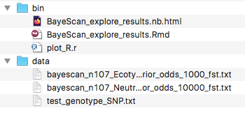

[BayeScan](http://cmpg.unibe.ch/software/BayeScan/download.html) es un sofware libre desarrollado por Foll y Gaggiotti (2008)
para identificar loci candidatos bajo selección natural a partir de datos genéticos, utilizando diferencias en las frecuencias de alelos entre poblaciones.

En esta práctica examinaremos utilizaremos los datos de prueba que vienen con el programa, así como los datos output de correr BayeScan disponibles en el [repositorio de datos del artículo de los lobos](https://datadryad.org/stash/dataset/doi:10.5061/dryad.8g0s3) (Schweizer et al 2016)

Referencias:

* Foll M and OE Gaggiotti (2008) A genome scan method to identify selected loci appropriate for both dominant and codominant markers: A Bayesian perspective. Genetics 180: 977-993

* Foll M, Fischer MC, Heckel G and L Excoffier (2010) Estimating population structure from AFLP amplification intensity. Molecular Ecology 19: 4638-4647

* Fischer MC, Foll M, Excoffier L and G Heckel (2011) Enhanced AFLP genome scans detect local adaptation in high-altitude populations of a small rodent (Microtus arvalis). Molecular Ecology 20: 1450-1462

* Schweizer, R.M., Robinson, J., Harrigan, R., Silva, P., Galverni, M., Musiani, M., Green, R.E., Novembre, J. and Wayne, R.K. (2016), Targeted capture and resequencing of 1040 genes reveal environmentally driven functional variation in grey wolves. Mol Ecol, 25: 357-379. https://doi.org/10.1111/mec.13467

* Schweizer RM, Robinson J, Harrigan R, Silva P, Galaverni M, Musiani M, Green RE, Novembre J, Wayne RK (2015) Data from: Targeted capture and resequencing of 1040 genes reveal environmentally driven functional variation in gray wolves. Dryad Digital Repository. http://dx.doi.org/10.5061/dryad.8g0s3.

## Datos y otros archivos para esta práctica

Puedes descargar los datos de esta práctica [en este zip](../data.zip), o uno por uno en el repositorio original de los datos y del zip de BayeScan. La práctica de abajo asume que los scripts se encuentran en un directorio llamado `bin`, que debe ser el WD, y un directorio al mismo nivel, llamado `data`. 

* `bayescan_n107_Ecotypes_GenicRegions_95CallRate_wEcotypes_output_prior_odds_1000_fst.txt` es el archivo output de correr BayeScan con los SNPs génicos de 107 lobos de 6 ecotipos, y `bayescan_n107_NeutralRegions_95CallRate_LDpruned_output_prior_odds_10000_fst.txt` es lo mismo pero con los datos neutrales (regiones no génicas). **Nota** en el repo de Dryad los archivos vienen con encabezado, yo se lo borré, pues el default de BayeScan no es ponerles encabezado y las funciones de R que vienen con el programa asumen que no hay encabezado.

* `test_genotype_SNP.txt` es un archivo de datos input de prueba que viene con BayeScan

Cuando [descargas BayeScan](http://cmpg.unibe.ch/software/BayeScan/files/BayeScan2.1.zip), el archivo zip también incluye unas funciones de R (revisa la práctica de [SweeD](https://aliciamstt.github.io/EvolAdapt/Unidad3_Test_selec_classic/SweeD_pvalues.html) para repasar cómo hacer y usar funciones de R fuera de las que vienen en paquetes). Puedes copiar y pegar la función dentro de tu script como hiciste antes, o mejor aún, tenerla en un **archivo separado** y **llamarla** desde R. En la siguiente sección veremos cómo hacer eso. Por lo pronto, copia el archivo [plot_R.r](plot_R.r) a la carpeta `bin` que estás ocupando como WD de esta práctica.

Para que la práctica funcione, la organización de tus archivos y directorios debe ser igual a esta (los archivo BayeScan_explore_resutls.html y .Rmd son los únicos que no debes tener, pues corresponden a estas notas. En su lugar, debes tener tu propio script o Rmd donde correr la práctica que sigue)




## Llamar funciones con source

Esto se hace con la función `source()`. `source()` **corre un script de R** dentro de nuestro script (como una Matroska), por lo que su input debe ser la ruta al archivo que contiene el script. 

Es buena práctica tener en scripts independientes funciones complejas o largas, o que utilizaremos en varios scripts distintos. De modo que en vez de copiar-pegar en varios lados, podamos simplemente llamarlas con `source()`. 

Yo puse en el WD del script de estas notas el archivo de la función de R que viene con BayeScan. Ahora hagamos un `source()` para tener disponible la función dentro de nuestra sesión:

Nota: como el archivo "plot_R.r" y tu script donde estás corriendo esta práctica **deben** estar en el directorio `bin`, que a su vez debe ser el WD, entonces basta con darle a `source()` el nombre del archivo, pues lo encontrará en el WD.

```{r}
source("plot_R.r")
```

Notarás que después de correr `source()`, si todo salió bien ahora deberás tener disponible la función `plot_bayescan` en tu ambiente de trabajo.

## Cargar datos de los lobos

Los archivos output de correr BayeScan con los datos de los lobos son 

Utilizaremos una ruta relativa (`../data/`) para leer los archivos que están en `data` desde nuestro directorio `bin`.


```{r}
# load data
wolves_genic<-read.csv("../data/bayescan_n107_Ecotypes_GenicRegions_95CallRate_wEcotypes_output_prior_odds_1000_fst.txt", 
                         sep="", header= FALSE,
                         col.names = c("bayescan_number", "prob",   "log10(PO)", "qval", "alpha", "fst"))

wolves_neutral<-read.csv("../data/bayescan_n107_NeutralRegions_95CallRate_LDpruned_output_prior_odds_10000_fst.txt", 
                         sep="", header= FALSE,
                         col.names = c("bayescan_number", "prob",   "log10(PO)", "qval", "alpha", "fst"))

```

** Ejercicio: ** consulta el manual de BayeScan y explora los datos ¿qué significa cada columna?

## Utilizar función `plot_bayescan()` 

Vamos a correr la función `plot_bayescan()` que viene con BayeScan primero con los datos de zonas génicas:
```{r}
# run function
results<-plot_bayescan("../data/bayescan_n107_Ecotypes_GenicRegions_95CallRate_wEcotypes_output_prior_odds_1000_fst.txt", FDR=0.05)

```

Revisar el número de outliers detectados:

```{r}
results$nb_outliers
```

La lista de outliers (id del locus) también se puede consultar:

```{r}
head(results$outliers)
```

**Ejercicio:** Divídanse por equipos y discutan ¿Cuántos outliers se detectaron y cuántos loci originalmente había? ¿A qué se debe este resultado?

## Repetir análisis del artículo

Los métodos del artículo de los lobos dicen lo siguiente:

*To assess diversifying selection among ecotypes, we used the Bayesian method implemented in BAYESCAN v2.1 (Foll & Gaggiotti 2008). BAYESCAN tests whether the subpopulation-specific allele frequencies are significantly different from those within the common gene pool and computes an alpha value to assess departures from neutrality. Significance is assigned by a measure of support for a model in which selection explains allele frequency differences among populations vs. a null model. Positive alpha values imply diversifying selection and negative values balancing or purifying selection. Given concern for elevated false positive rates for detecting balancing or purifying selection under isolation by distance (Lotterhos & Whitlock 2014), we focus on diversifying selection. In populations where isolation by distance is present, as is the case here (Schweizer et al. 2015), BAYESCAN can have high false positive rates unless a large set of neutral loci are used to generate empirical P-values (Lotterhos & Whitlock 2014). Therefore, we ran BAYESCAN separately for the neutral and genic regions, with prior odds of 10 000 and 1000, respectively, and calculated empirical P-values of alpha with a BH correction for multiple testing, as was done for SWEED.*

**Ejercicio:** dividanse por equipos, revisen las notas de la práctica de SweeD y expliquen brevemente cómo hacer lo anterior (nombren los princiapales pasos y funciones).

#### Ejercicio resuelto:

Primero calculamos la función ECDF con los datos neutrales

```{r}
# estimate the empirical cumulative distribution functione with neutral data
Likelihood_Function <- ecdf(wolves_neutral$prob)
```

Después evaluamos esa función con los datos genéticos:

```{r}
# run function
x<-Likelihood_Function(wolves_genic$prob)

# check results
head(x)
length(x)
```

Ahora sí calculamos el p value, como 1 - los valores resultados anteriores.

```{r}
Likelihood_PVAL<-1-x
```

Dado que estamos haciendo muchas comparasiones, es necesario corregir los p-value. Esto se hace con la función p.adjust() (tmb del paquete stats) siguiendo uno de varios métodos posibles. En el artículo escogieron el "BH", que viene de Benjamini & Hochberg (1995) y que también se conoce como "FDR" por "False discovery rate".

```{r}
Likelihood_FDR=p.adjust(Likelihood_PVAL,"BH")
```
 
Crear una df nueva con los resultados que incluya los datos originales y los pvalues

```{r}
# copy original data
results<-wolves_genic 

# add pvalues
results$pval <- Likelihood_PVAL
results$pval.adjust <- Likelihood_FDR

```

Examinemos cuáles son significativos ahora:

```{r}
sum(results$pval.adjust<=0.001)
```

Explorar loci significativos mediante varias gráficas:

```{r}
# plot
library(ggplot2)

ggplot(results, aes(x=fst, y=alpha)) +
  geom_point(size=2, alpha=0.5,
  aes(colour = pval.adjust <= 0.001 )) + # colorear por umbral significancia
  scale_color_manual(values = c("black", "red"))
```

```{r}
ggplot(results, aes(x=bayescan_number, y=fst)) +
  geom_point(size=2, alpha=0.5,
  aes(colour = pval.adjust <= 0.001 )) + # colorear por umbral significancia
  scale_color_manual(values = c("black", "red"))
```

```{r}
ggplot(results, aes(x=bayescan_number, y=alpha)) +
  geom_point(size=2, alpha=0.5,
  aes(colour = pval.adjust <= 0.001 )) + # colorear por umbral significancia
  scale_color_manual(values = c("black", "red"))
```

**Ejercicio:** Divídanse por equipos. Escriban una función que corra desde la función `ecdf()` hasta crear la df de resultados (ie todo lo anterior menos los plots). Los argumentos deben ser: 
* df con datos neturales, 
* df con datos génicos y,
* método con el que se quiere utilizar la función `p.adjust()`. 

El output debe ser una df con los datos génicos originales más dos columas con el pval y el pval ajustado. 

La función debe escribirse en un archivo de R independiente para podarla llamar con `source()`. No olvides documentarla al inicio (qué hace la función, cuáles son sus argumentos) y comentar cada paso. Los comentarios deben ser en inglés.


