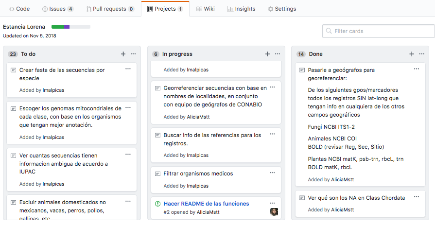
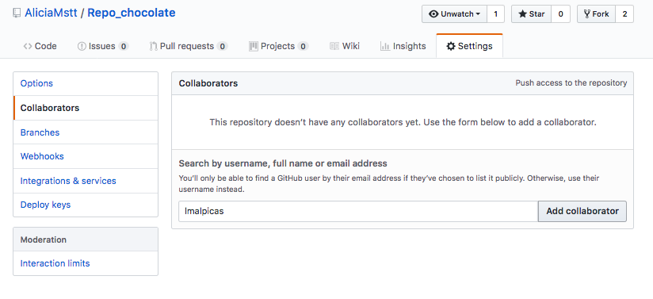
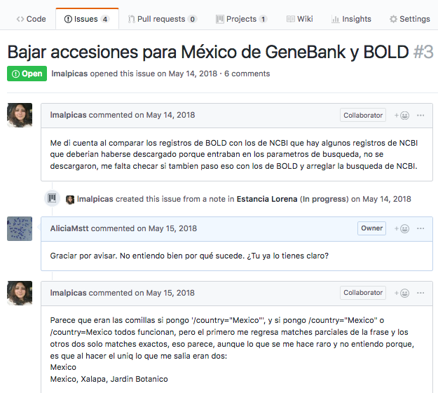

# Git y github

Github es un repositorio de código que:

* Utiliza `git` para llevar un sistema de **control de versiones**,
* Tiene una interfase Web pública
* Permite escribir/revisar código en equipo
* Su símbolo es un gatopulpo. 


## Introducción a git 

[`git`](https://git-scm.com/) es un programa que sirve para llevar el control de versiones de un proyecto informático. Puedes entenderlo como una mezcla de control de cambios de word con el versionamiento de documentos de GoogleDrive para saber qué cambios hiciste a un script, por qué y cuándo, de manera que es más fácil mantener el orden, "volver al pasado" y trabajar en paralelo con colegas.

Es muy buena idea llevar un control de versiones de tus scrips en tu carpeta `bin`.

Sin embargo, cuando subas tu proyecto con todo y datos como un repositorio (e.g. a Dryad) recuerda **NO** compartir la carpeta `.git`. (NOTA QUE HAY UN `.`, es decir es una carpeta oculta donde viven los misterios de git).

Para aprender más es muy buena idea leer [An Intro to Git and GitHub for Beginners (Tutorial) de Meghan Nelson](https://product.hubspot.com/blog/git-and-github-tutorial-for-beginners).

Como introducción más profunda a `git` recomiendo leer los principales conceptos y el [flujo de trabajo de Github de esta documentación](https://guides.github.com/introduction/flow/). 


### Los términos más importantes 

Estos son los terminos y comandos más importantes para trabajar en tu propio repositorio de Github (no veremos aquí el modo colaborativo):

+ **Repositorio**: Se usa para organizar un proyecto. Puede contener imágenes, código, etc. Es recomendable incluir un README.

+ **Commit**: Equivale a **guardar los cambios en git acompañado de una nota**. Es el equivalente a auto-enviarte por correo el archivo en el que estuviste trabajando para tener un backup, con una nota para reconoer esos cambios. ¡Ojo! Los cambios se guardan en la `branch` (ver abajo) donde trabajas. Debes acompañar el `commit` de un mensaje corto para especificar qué cambios hiciste. Esto es mucho mejor que tener nombres de archivos larguísimos tratando de explicar qué versión son (e.g. `Tesis_final_comentariosAMY_DP_rev22oct2017_comentariosFran_revEnero2018_FINAL_BUENO_corrected_2.doc`).

+ **Fork**: Se crea un fork cuando el repositorio es copiado de la cuenta de un miembro de Github a la de otro. Cada copia sigue su vida independiente.

+ **Branch**: El repositorio tiene una rama o branch principal llamada `main`, que es la "original". Se pueden crear otras ramas dentro del mismo repositorio en las cuales se pueden hacer modificaciones sin afectar el código original. Es el equivalente tener un archivo original `Tesis` y ponerle `Tesis_comentariosAsesora1` y `Tesis_comentariosAsesor2` a los archivos con los comentarios de tus asesores, mismos que eventualmente volverás a integrar en un archivo final (pero `git` lo hace todo más hermoso y organizado). Las ramas son un nivel avanzado, que puedes ignorar de inicio.

#### `git init`

Te permite crear un repo *en tu computadora*. En la terminal escribe:

```
$ mkdir repo_name # crear un directorio en tu disco local
$ cd repo_name
$ git init # transformar ese directorio en un repositorio git
$ git status # verificar que el repositorio ha sido creado
```

Para conectar ese nuevo repostorio a github:

* Log in en tu cuenta de github
* En 'Repositories' click en el boton verde 'NEW"
* Dale el mismo nombre que tu repostorio de tu computadora (el nombre del directorio) y click en el botom 'Create repository'
* Vuelves al terminal para conectar tu repo local con el repo en github, usando:

```
$ git remote add origin https://github.com/<username>/<repo_name>.git
$ git push -u origin master
```

#### `git clone`
Te permite copiar *a tu computadora* un repositorio que *ya existe en github*. Cada versión de cada archivo de la historia del proyecto es descargado cuando lo ejecutas. La dirección del repo que quieres clonar puedes conseguirla en el botón verde que dice "Clone or Download" en la página principal del repo en Github.

**Ojo con dónde corres `git clone`, pues tu working directory será el lugar a donde "se baje" el repo que estás clonando.**

```
$ git clone https://github.com/AliciaMstt/Repo_chocolate.git
Cloning into 'Repo_chocolate'...
remote: Counting objects: 3, done.
remote: Compressing objects: 100% (2/2), done.
Unpacking objects: 100% (3/3), done.
remote: Total 3 (delta 0), reused 0 (delta 0), pack-reused 0

```

Para poder hacer los siguientes comandos debemos estar en el directorio del repo. Es decir lo que acabamos de bajar. Así que `cd Repo_chocolate`.

#### `git status`
Es para saber en qué branch estas trabajando y si tienes archivos que te falte "guardar" (commit). Por ejemplo, si lo haces cuando acabas de clonar un repositorio, debe verse algo así:

```
$ git status                           []
On branch master
Your branch is up-to-date with 'origin/master'.
nothing to commit, working tree clean
```

#### `git add`
Te permite agregar los archivos que quieres **agregar al commit**. Esto no lo "guarda" (commit), solo hace que "lo sigas". Si modificas un archivo y quieres hacerle un `commit` es necesario que antes le vuelvas a dar `add`.

Puedes imaginarte que es como "adjuntar" los archivos al correo que te vas a auto-enviar como respaldo de tu trabajo.

```
$ touch ejemplo.txt
$ git status
On branch master
Your branch is up-to-date with 'origin/master'.
Untracked files:
  (use "git add <file>..." to include in what will be committed)

	ejemplo.txt

nothing added to commit but untracked files present (use "git add" to track)
$ git add ejemplo.txt
```


#### `git commit`
Confirma y agrega los cambios a la branch en la que estas trabajando. Utiliza la flag `-m` para escribirun mensaje breve. Si no lo haces se abrirá un editor de texto donde puedes describir brevemente el cambio que hiciste. Si tu editor es Vim, puedes guardar y salir con `:wq`.

```
$ git commit -m "agregar archivo ejemplo"
[master 79fce15] agregar archivo ejemplo
 1 file changed, 0 insertions(+), 0 deletions(-)
 create mode 100644 ejemplo.txt
```

Imagínate el `commit` como escribir el correo describiendo los cambios de los archivos de los que quieres tener un resplado, como "introducción corregida con comentarios de JP".

#### `git diff`
Para ver los cambios que se hicieron a un archivo.

```
$ echo "el mundo es bello" > ejemplo.txt
$ cat ejemplo.txt 
el mundo es bello
$ git status
On branch master
Your branch is up-to-date with 'origin/master'.
Changes not staged for commit:
  (use "git add <file>..." to update what will be committed)
  (use "git checkout -- <file>..." to discard changes in working directory)

	modified:   ejemplo.txt

no changes added to commit (use "git add" and/or "git commit -a")
$ git diff ejemplo.txt
diff --git a/ejemplo.txt b/ejemplo.txt
index 8d269c1..0dc4fee 100644
--- a/ejemplo.txt
+++ b/ejemplo.txt
@@ -1 +1 @@
-bla bla bla
+el mundo es bello
```


#### `git rm`
Si quieres borrar un archivo **que ya había formado parte de un commit** no sólo de tu compu sino del sistema de versiones de git, lo mejor es NO utilizar `rm`, sino `git rm`. Ejemplo:

```
$ touch ejemplo2.txt
$ git add ejemplo2.txt
$ git status
On branch master
Your branch is ahead of 'origin/master' by 1 commit.
  (use "git push" to publish your local commits)
Changes to be committed:
  (use "git reset HEAD <file>..." to unstage)

	new file:   ejemplo2.txt
$ git add ejemplo2.txt
$ git commit -m added ejemplo2
$ git rm ejemplo2.txt
$ git status
On branch master
Your branch is ahead of 'origin/master' by 2 commits.
  (use "git push" to publish your local commits)
Changes to be committed:
  (use "git reset HEAD <file>..." to unstage)

	deleted:    ejemplo2.txt

```

#### `git push`

Una vez que quieres **enviar tus cambios a Github** debes hacer "empujarlo". Debes decirle el origen (rama donde hiciste los commits) y el destino (por ejemplo mainu otra rama). Por default (si no le dices nada) los cambios se envían de la rama de trabajo donde estés a la rama principal.

**Ojo** uds no podrán hacer `push` porque no son propietarios del repo chocolate (en esta clase no veremos cómo hacer push a repos que no sean propios).


```
$ git push origin master
Counting objects: 3, done.
Delta compression using up to 4 threads.
Compressing objects: 100% (2/2), done.
Writing objects: 100% (3/3), 285 bytes | 0 bytes/s, done.
Total 3 (delta 0), reused 0 (delta 0)
To https://github.com/AliciaMstt/Repo_chocolate.git
   72129b3..79fce15  master -> master
```

Nota: puedes agregar la flag `-u` para establecer `origin master` (o lo que sea) como el default y solo tener que hacer `git push` en un futuro.


#### `git pull`
Actualiza la copia del repositorio local (computadora) con respecto a la rama remota (Github). Es decir


```
$ git pull                             []
Already up-to-date.
```


#### `git log`

Para ver el historial de commits que se han hecho en el repo. Por default te mostrará los commits en orden cronológico invertido, pero hay muchas opciones que puedes darle para buscar algo más específico. [Instrucciones aquí](https://git-scm.com/book/en/v2/Git-Basics-Viewing-the-Commit-History).

#### `git` para la vida diaria en resumen:

0) `git pull` para jalar los cambios de una rama en Github a nuestra rama local (compu).

1) `git status` dentro del directorio de tu repo para ver si hay cambios.

2) `git diff nombrearchivo` para ver las modificaciones que se hicieron a un archivo desde el último commit.

3) `git add nombrearchivo` (para un archivo) o `git add *` (para todos los archivos) para agregar los archivos **que queremos incluir en un commit**. Como el equivalente a "adjuntarlos" en un correo que te enviarías por correo. 

4) `git commit -m "mensaje corto explicando qué contiene el commit"`. Como el contenido de un correo donde te explicarías a tí mismx qué cambios hiciste que ameritan guardar la versión ("commit").

5) `git push` para enviar nuestros cambios locales a Github.


#### ¿Cómo volver al pasado?

Hay muchas formas. [Esta respuesta de Stacksoverflow es una buena guía](https://stackoverflow.com/questions/4114095/how-to-revert-a-git-repository-to-a-previous-commit).


### ¿Qué seguir y no seguir con `git`?

Es buena práctica que **lleves un historial de versiones de todos tus scripts con `git`**.

Pero hay otros archivos no queremos que sean considerados por `git`, por ejemplo archivos que la compu hace en automático como los "fantasmitas de Mac" o archivos de datos muy pesados si queremos solo publicar el código (que generalmente es el caso) Podemos entonces decirle a git cuáles archivos ignorar. Pasos:

1) Crear un archiovo `.gitignore` en el wd de tu repositorio (donde vive tu `.git` que se creó con `git init` o con `git clone`).

`touch .gitignore` (nota el punto `.`)

2) En ese archivo poner el nombre (o las extensiones) de los archivos que quieres ignorar. [Aquí puedes ver una lista de casos comunes proporcionada por Github](https://gist.github.com/octocat/9257657).

Por ejemplo yo voy ignorar los fantasmitas Mac:


`$ nano .gitignore`

Y pegué lo siguiente:

```
# OS generated files #
######################
.DS_Store
.DS_Store?
._*
.Spotlight-V100
.Trashes
ehthumbs.db
Thumbs.db

```

Si quiero **ignorar una carpeta completa**, por ejempo `/data` entonces debo ponerla así:

```
## Ignore data directory 
/data
```


3) Si haces un `git status` notarmás que aparece `.gitignore` como untracked. Entonces debes:

```
$ git add .gitignore
$ git commit -m "Added .gitignore file to repo"
$ git push 
```

También puedes crear un `.gitignore` global que aplique en todos los repos de tu compu. Instrucciones [aquí](https://help.github.com/articles/ignoring-files/)


## Manejo de proyectos e issues en Github

Como hemos visto GitHub te permite llevar un control de versiones, es decir, llevar un registro de los cambios que se realizan sobre un proyecto informático, particularmente sobre las modificaciones a los scripts.

Github además permite organizar proyectos con un sistema de asignación "tareas por hacer" que se pueden asignar a un usuario de forma colaborativa, o a una misma para mantener un proyecto propio sin perderse.

Puedes generar tareas ("cards") y páneles de estado (Pendientes, En Proceso, Terminadas, por ejmemplo). Lueg puedes arrastraslas de un panel a otro según vayas progresando.




Los proyectos solo los podemos ver si es nuestro repositorio o si estamos agregados como colaboradorxs en ellos. Para agregar a un colaborador ve la pestaña "Settings" (arriba derecha) y luego a "Collaborators" en el menú de la izquierda. Debes buscar a quien quieras agregar por su nombre de usuario en Github. El usuario debe aceptar la invitación para unirse formalmente al proyecto.



Las tareas ("cards") de un proyecto pueden quedarse como tareas simplemente, o volverse un **issue**. Los issues permiten delimitar una tarea que debe atenderse (por ejemplo un bug, una modalidad nueva deseada, etc) pero cuya solución además requiere discusión. Cada issue tiene asociado entonces una conversación. Tanto los issues como sus conversaciones asociadas son públicos, pues permiten al público saber, por ejemplo, que el problema existe y en qué va su solución.


  


